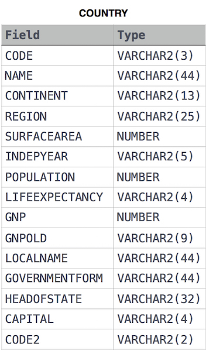

[comment]: <> (Written: 13-Oct-2022)

## African Cities
Given the **CITY** and **COUNTRY** tables, query the names of all cities where the CONTINENT is 'Africa'.

**Note**: CITY.CountryCode and COUNTRY.Code are matching key columns.

### Input Format
The **CITY** and **COUNTRY** tables are described as follows:




&nbsp;
## Solution (MySQL)
```
SELECT
    city.name
FROM
    city LEFT JOIN country ON city.countrycode = country.code
WHERE
    country.continent="Africa"
```